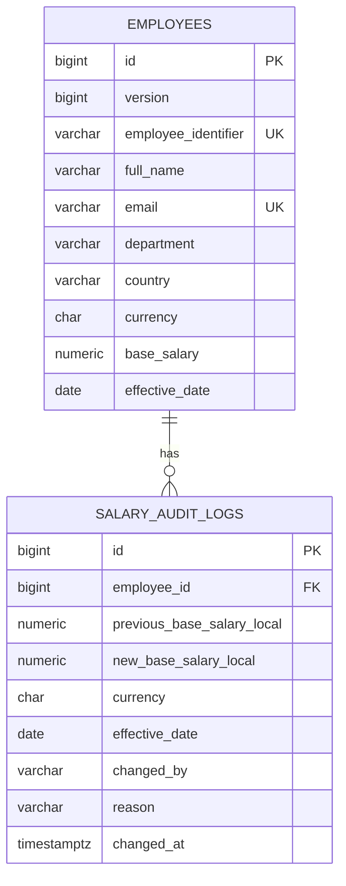

# ACME Salary Management — Database Architecture

**Status:** Baseline for implementation
**Database:** PostgreSQL 16
**Companion documents:** [requirements.md](requirements.md), [architecture.md](architecture.md), [commit-plan.md](commit-plan.md)

## Purpose and boundaries

The database is the durable source of truth for employee salary data and salary-change history. It supports a 10,000-employee operational workload: paginated directory reads, safe salary updates, and currency-separated compensation analytics. It does not calculate payroll, store bonuses, or convert currencies in v1.

## Logical model



`employees` holds the current salary state. `salary_audit_logs` is append-only historical evidence through the application: the application exposes no update/delete operation for it. An employee creation produces one audit row with a null previous salary and system reason `Initial Employee Setup`. Currency is deliberately repeated in history even though it is immutable on the employee so every audit row is self-contained.

## Physical schema rules

| Concern | Rule |
| --- | --- |
| Identifiers | `BIGINT` primary keys use PostgreSQL sequences; the JPA sequence generator and sequence allocation size must match. Employee identifier and email are unique. |
| Money | `NUMERIC(14,2) NOT NULL` for a current/new salary; a previous salary is nullable only for the creation event. Database `CHECK` constraints require positive current/new values; application code owns half-even normalisation. |
| Currency | `CHAR(3) NOT NULL`, validated as an ISO-4217 code by the application. Currency is stored with current and historical salary data. |
| Integrity | Names, email, department, country, currency, effective date, and current salary are required. The employee `version` is non-null for optimistic locking. Every audit reason has a database `CHECK` requiring at least 10 trimmed characters; `Initial Employee Setup` satisfies that rule. |
| History | Audit rows cannot be changed or deleted through the application. The employee foreign key uses `ON DELETE RESTRICT`, never cascade delete. |
| Time | `effective_date` is the business date of the current salary (today only in v1); `changed_at` is the `TIMESTAMP WITH TIME ZONE` at which the audit event was committed, sourced from an application `Instant`. |

Flyway is the sole schema-change mechanism. Hibernate uses schema validation, not schema creation or alteration. Each structural decision is introduced through a versioned migration and an integration test.

## Access patterns and indexes

The schema begins with indexes that correspond to known user paths, then validates them with `EXPLAIN ANALYZE` against the deterministic 10,000-record seed. An index is a hypothesis to measure, not a promised latency figure.

| Query purpose | Baseline index |
| --- | --- |
| Employee lookup | unique employee identifier; unique email |
| Directory filter | `(department, country)` plus the individual filter index only if query plans demonstrate a need |
| Department currency analytics | `(department, currency)` |
| Country currency analytics | `(country, currency)` |
| Employee history | `(employee_id, changed_at DESC)` |

Directory search is an explicit open decision before the directory increment: compare a `LOWER()` functional index with a trigram index against the seeded dataset using `EXPLAIN ANALYZE`, then commit the selected migration and its integration test. A full-text index is not assumed from the outset.

## Analytics contract

All pagination, filtering, counts, averages, and medians are executed by PostgreSQL projections. Analytics group by both business dimension and currency:

```text
(department, currency) → headcount, average, median
(country, currency)    → headcount, average, median
```

PostgreSQL `percentile_cont(0.5)` is the proposed median implementation. Integration tests use a known fixture, and query plans are captured before performance claims are made. The application never loads 10,000 entities to sort or calculate aggregates in JVM memory.

## Transactions and concurrency

A salary update runs as one transaction: load employee, check/apply the versioned change, persist current state, then append one audit row. Salary currency is immutable after employee creation, and v1 accepts only today's effective date; scheduled and backdated salary changes need a later temporal model. An optimistic-lock failure rolls back the whole transaction; it produces a `409 Conflict` and no audit row. The audit actor is taken from server authentication, not the request payload.

## Seed and migration lifecycle

A dedicated non-production seed profile runs only when the employee count is zero. It generates exactly 10,000 deterministic employees in one transaction using Hibernate JDBC batching (`hibernate.jdbc.batch_size=500`, `hibernate.order_inserts=true`, `hibernate.jdbc.batch_versioned_data=true`, and a sequence-based identifier strategy); it is safe to rerun. These settings live in the demo seed profile and are verified by a seed integration test. The deployed demo uses this explicit profile; it is never enabled by default in a production deployment.

The first migration creates sequences, `employees`, constraints, and directory/analytics indexes. The second creates `salary_audit_logs`, its foreign key, and history index. Additional migrations are added only when a failing integration test demonstrates a new persistence need.
